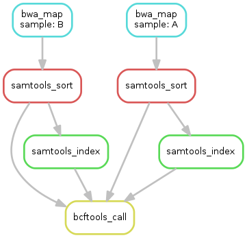

# Translate_Snakemake_Tutorial
Snakemake の[チュートリアル](http://htmlpreview.github.io/?https://bitbucket.org/johanneskoester/snakemake/raw/master/snakemake-tutorial.html)翻訳


Snakemake チュートリアル
---

このドキュメントは私の使用しているPythonベースのパイプライン作成ツール[Snakemake](https://bitbucket.org/johanneskoester/snakemake/wiki/Home)の[チュートリアルページ](http://htmlpreview.github.io/?https://bitbucket.org/johanneskoester/snakemake/raw/master/snakemake-tutorial.html)の翻訳です。
パイプラインツールは星の数ほどあるのですべてを試したわけではありませんが、私はSnakemakeにはおおむね満足しています。利点としては

1. pythonベースであること。
2. 制作者が親切でコミュニティの活動が活発であること
3. Makeに近い文法であること
4. チュートリアルが非常に親切であること

などがあげられるでしょう。
以下に[公式のFAQ](https://bitbucket.org/johanneskoester/snakemake/wiki/FAQ)の初め2つの翻訳を載せます。これを読めば大体どんなツールなのかわかるのではないでしょうか

---

> ###What is the key idea of Snakemake workflows?
The key idea is very similar to GNU Make. The workflow is determined automatically from top (the files you want) to bottom (the files you have), by applying very general rules with wildcards you give to Snakemake:

###Snakemakeの基本的なアイディアはどういったものですか？
基本的にはGNU Makeに非常に近いものです。ファイルの一番上(あなたが手に入れたいファイル)に向かって一番下(あなたが持っている生データ)から、ワイルドカードを用いた一般的なルールを適用することでワークフローを自動で構築します。


> ###Why Snakemake if there is Galaxy (or some other convenient tool) ?
Good question, especially since Snakemake does not offer a graphical user interface (GUI). Instead, Snakemake is like a simple programming language for workflows with direct Python integration. Consider for example Galaxy with a complex workflow of 20 steps on a dataset with 100 different samples, which is not too unusual these days. Galaxy will attempt to keep track of (and display) your analysis history, eat up lots of disk space and overwhelm you with irrelevant information. Also, you have to start the workflow 100 times by clicking somewhere. The goal of Snakemake and Snakefiles is that the final workflow (which will be written incrementally as you develop it) will produce all your output files from the input files (the raw data) just by running Snakemake in the appropriate directory without further interaction.

###どうしてGALAXY(あるいは他のツール)があるのにわざわざSnakemakeを使用するのですか？
いい質問です。SnakemakeにはGUIがついていないのでそう思うのも無理はありません。どちらかと言えばPythonを取り込んだシンプルなプログラミング言語であるといえるでしょう。
Galaxyで20ステップの複雑なワークフローを100個の異なるサンプルに対して適用する状況(最近だとこれはあまり珍しい状況ではありません)を考えてみてください。Galaxyは解析の履歴をすべて保持しディスプレイし続けます。ディスクスペースを圧迫し、関係のない情報をあなたに与え続けるのです。また、100回のワークフローを走らせるために毎回どこかをクリックしなくてはなりません。
SnakemakeとSnakefileの目標は段階的にワークフローを作成していき、最終的には特定のディレクトリで`snakemake`を実行するだけで、インプットからアウトプットまですべてのパイプラインを自動で実行できるようにすることです。

---

Citationの仕方などについては[公式のHome](https://bitbucket.org/johanneskoester/snakemake/wiki/Home)を見てください。
以下がチュートリアルです。多少意訳しています。


#Snakemake Tutorial

このチュートリアルではテキストベースのワークフローシステムであるSnakemakeの解説をします。SnakemakeはGNU Makeのパラダイムに従い、インプットファイルからアウトプットファイルを生成するための方法としてワークフローを定義しています。ルール間の依存関係は自動的に解決され、それぞれのジョブはDAG(Directed Acyclic Graph: 有向非巡回グラフ)として定義されます。ジョブは自動的に並列化することが可能です。

Snakemakeは以下の点でほかのテキストベースのワークフローシステムとは一線を画しています。
1. Pythonインタプリタを利用することで、ルールやワークフロー固有のプロパティを定義するためにPythonを拡張した言語を用いることが可能になった点。
このおかげで通常のスクリプト言語のようなフレキシビリティとpythonicなワークフローの定義の両方が可能になりました。Pythonは簡潔かつ擬似コードのような読みやすさで知られています。SnakemakeによるPythonの文法の拡張は、このようなpythonの特性をワークフローの構築にも適用することを可能にしました。
2. 並列計算への対応
さらに、Snakemakeのスケジューリングアルゴリズムは、プロパティやコア数を指定することで制限を加えることができるほか、分散コンピューティング環境(クラスターやバッチシステム)へのサポートにも対応しています。それゆえ、シングルコアの単一ワークステーションからマルチコアの分散メモリ環境までスケールするのです。

ここではバイオインフォマティクスの解析を例に説明しますが、SnakemakeはGeneral-purposeを指向しているので、どのような目的にも使うことができます。

Note: チュートリアル以上の最新の情報を手に入れたい場合は[Snakemakeのホームページ](https://bitbucket.org/johanneskoester/snakemake/wiki/Home)を参照してください。また、[こちらのイントロダクション用のスライド](http://slides.com/johanneskoester/deck-1#/)も参考になります。

---

##Setup
このチュートリアルの実行のためには以下のソフトウェアをインストールする必要があります。

- [python](http://www.python.org/) >= 3.3
- [Snakemake](https://bitbucket.org/johanneskoester/snakemake) 3.4.2
- [BWA](http://bio-bwa.sourceforge.net/) 0.7.12
- [SAMtools](http://www.htslib.org/) 1.2
- [BCFtools](http://www.htslib.org/) 1.2
- [Graphviz](http://www.graphviz.org/) 2.38.0
- [PyYAML](http://pyyaml.org/) 3.11
- [Docutils](http://docutils.sourceforge.net/) 0.12

これらをセットアップするもっとも簡単な方法は[Miniconda](http://conda.pydata.org/miniconda.html)のPython3ディストリビューションを使用することでしょう。
以下ではMac OS Xか、Linux上で実行することを想定しています。Miniconda、SnakemakeともにWindows上でも動かすことは可能ですが、シェルの文法があまりにも違うので、一般的な例としては適していないと判断し、ここでは触れないことにします。

###Vagrantを用いてwindows上にLinuxVMを起動する。
すでにLinuxかMac OS Xを使用している場合は*ステップ1*に飛んでください。
Windowsを使用している場合、Vagrantを用いてLinuxの仮想マシン(VM)をセットアップすることができます。まず[公式ドキュメント](https://docs.vagrantup.com/)に従ってVagrantをインストールしてください。次に、適当なディレクトリ(例えば`vagrant-linux`)をどこかに作ってください。コマンドプロンプトを開き、そのディレクトリに移動してください。ここでは64bitのubuntu仮想環境を作成します。以下のコマンドを入力してください。

```sh
vagrant init hashicorp/precise64
vagrant up
```

32bitのイメージを使う場合は以下のMinicondaも32bit版のものを使用する必要があります。
`vagrant-linux`フォルダの内容は仮想マシンと共有することが可能になります。仮想マシンにログインするには

```sh
vagrant ssh
```

を入力してください。
SSHクライアントのインストールを要求される場合は[こちら](http://blog.osteel.me/posts/2015/01/25/how-to-use-vagrant-on-windows.html)を参考にしてください。
ここからはLinux仮想環境下で以下のチュートリアルを行ってください。

###ステップ1: Miniconda3のインストール
まず*ターミナルを開く*か、仮想マシンにログインしていることを確かにしてください。64bit環境の場合、以下のコマンドでMiniconda3をインストールできます。

```sh
wget https://repo.continuum.io/miniconda/Miniconda3-latest-Linux-x86_64.sh
bash Miniconda3-latest-Linux-x86_64.sh
```
MacOS Xの場合は
```sh
wget https://repo.continuum.io/miniconda/Miniconda3-latest-MacOSX-x86_64.sh
bash Miniconda3-latest-MacOSX-x86_64.sh
```
32bitの場合もほぼ同様ですが、上記のコマンドから`_64`除く必要があります。以下のような質問を受けたら

```sh
Do you wish the installer to prepend the Miniconda3 install location to PATH ...? [yes|no]
```

*yes*と答えてください。
Minicondaは最小限のpython3環境に加え、Condaというパッケージマネージャを含んでいます。ターミナルを新しく開けば、`conda`コマンドでパッケージインストールや周りから独立した環境を作り、それによって同じソフトウェアの異なるバージョンを指定して使うことができるようになります。後ほど`Conda`を用いて独立した環境内に必要なソフトをすべて入れます。

###ステップ2: ワーキングディレクトリの準備

まず、`snakemake-tutorial`という名のディレクトリを適当なところに作り、ターミナルでそこに移動してください。Windows上の仮想マシンである場合は`/vagant/`以下に作成することで、ホストOSとの共有が可能になります。
次に、以下のようにexampleデータをダウンロードしてください。

```sh
wget https://bitbucket.org/johanneskoester/snakemake/downloads/snakemake-tutorial-data.tar.gz
tar -xf snakemake-tutorial-data.tar.gz

```

これで`data`フォルダと`requirements.txt`というファイルができるはずです。

###ステップ3: ソフトウェアのインストール
この`requirements.txt`を以下のように用いることで、`conda`がチュートリアルに必要なすべてのファイルをインストールしてくれます。

```
conda create -n snakemake-tutorial -c bioconda --file requirements.txt
```

`conda`は`-c`オプションを指定することで、インストール元を指定することができます。ここでは[Bioconda](https://bioconda.github.io/)を用いています。

###ステップ4: 環境をアクティベート
`snakemake-tutorial`という環境をアクティベートする場合、以下を実行してください。

```sh
source activate snakemake-tutorial
```
これでインストールされたソフトウェアを使用可能になりました。以下を実行してみましょう

```sh
snakemake --help
```

環境をディアクティベートしたい場合は以下を実行してください。
```sh
source deactivate
```
ただ、*今はまだしないでください*。まだsnakemakeを使った作業をしていませんからね:-)


##基本となるワークフローの例
上で作られた環境がアクティベートされ、そのディレクトリにいることを確認してください。
まずは`Snakefile`という名前のファイルをお好きなエディタで作成してください。おススメは[Atom](https://atom.io/)です。Snakemake用のイカしたシンタックスハイライトが用意されています。(訳中:[公式のFAQ](https://bitbucket.org/johanneskoester/snakemake/wiki/FAQ)によればvimでもシンタックスハイライトがあるようです)
Snakefileを開いたら以下のようなrule:を記述してください

```snakefile
rule bwa_map:
    input:
        "data/genome.fa",
        "data/samples/A.fastq"
    output:
        "mapped_reads/A.bam"
    shell:
        "bwa mem {input} | samtools view -Sb - > {output}"
```

Snakemakeのルールにはそれぞれ名前(ここでは`bwa_map`)が付き、そこにいくつかのディレクティブが付属します。ここでは`input`、`output`、`shell`です。`input`、`output`ディレクティブにはルールによって作成、あるいは使用されるファイルが付属しています。もっとも単純な例では、これらは単なるpythonの文字列オブジェクトです。
`shell`指示分にはシェルに渡されるpython文字列が付属しています。この中では波括弧`{}`を用いることにより、rule内の要素にアクセスすることができます。(pythonの`format()`関数のようなものです)ここでは`{output}`,`{input}`が`input:`,`output:`の各要素に展開されます。
この場合は`input:`の要素が複数あるため、半角スペースで区切られた形で展開されます。言い換えるとSnakemakeは`{input}`を`data/genome.fa data/samples/A.fastq`に置き換えるということです。
ここでは`bwa mem`でマッピングし、出力結果を`samtools`にパイプしてbamに変換したのち、アウトプットファイルに出力しています。
ワークフローを実行するとSnakemakeはコマンドラインで指定した特定のターゲットファイルを生成しようとします。以下のコマンドをSnakefileのあるディレクトリで実行すると

```sh
snakemake -pn mapped_reads/A.bam
```

Snakemakeは`mapped_reads/A.bam`を生成しようとします。ただし、ここでは`-n`(あるいは`--dryrun`)を指定しているので、実際には実行せず、実行されるタスクの詳細をプリントするにとどまります。また、`-p`は実行されるシェルコマンドを全てプリントすることを指示するものです。
ターゲットファイルを生成するにあたって、*snakemakeはsnakefile内で定義されたルールを上から下に向かって実行します。*特定のアウトプットファイルを生成するために必要なルールのそれぞれを*ジョブ*と呼びます。あるジョブのインプットファイルを作成するために必要なジョブをSnakemakeは再帰的に決定します。このため、それぞれのジョブを頂点とし、依存関係を辺とする非巡回有向グラフ(DAG)のかたちでワークフローを表すことが可能になります。今のところルールは一つしかありませんので、ジョブのDAGは単一の頂点のみになります。では実行してみましょう

```sh
snakemake mapped_reads/A.bam
```

一度これを実行すると、もう一度同じコマンドを行ってもSnakemakeは`mapped_reads/A.bam`を生成しないことに注目してください。これはファイルシステム内にターゲットファイルがすでに存在しているためです。
*Snakemakeが同じジョブを実行するのはinputのうちのどれかがoutputファイルよりも新しいか、あるいは別のジョブによってアップデートされたときのみとなります。*

###ステップ2: 上述のルールを一般化する
上のルールは`data/samples/A.fastq`にしか適用されません。しかしSnakemakeならば*ワイルドカードを用いてルールを一般化することができます*。インプットファイルの2つ目とアウトプットファイルの`A`を`{sample}`というワイルドカードで置き換えてみましょう。つまりSnakefileは以下のようになります。

```snakefile
rule bwa_map:
    input:
        "data/genome.fa",
        "data/samples/{sample}.fastq"
    output:
        "mapped_reads/{sample}.bam"
    shell:
        "bwa mem {input} | samtools view -Sb - > {output}"
```

`{sample}`を適切な値で置き換えることによって、アウトプットファイルを生成できるとSnakemakeが判断した場合、`input:`内にある`{sample}`の全てをその値で置き換えることによって、ジョブの実行に必要なインプットファイルを決定します。複数のワイルドカードをファイルパスの中で使用することも可能ですが、同一ルールから生成される複数のジョブ間での名前の衝突を避けるため、そのルール内のすべてのアウトプットファイルは同一のワイルドカードを持っている必要があることに注意してください。
ここで以下を実行すると

```sh
snakemake -np mapped_reads/B.bam
```

Snakemakeは`{sample}`を`B`に置き換えればターゲットファイルを生成することができると判断します。そのため、dry-runの出力から、インプットファイルも置き換わっていることがわかるでしょう。
また、複数のターゲットを指定することもできるようになります。例えば

```sh
snakemake -np mapped_reads/A.bam mapped_reads/B.bam
```

ちょっとしたシェル芸を使用すれば同じことをこのように書くこともできます。

```bash
snakemake -np mapped_reads/{A,B}.bam
```

これはSnakemakeとは関係のない、単なるbashの機能であることに注意してください。
いずれの書き方にせよ、Snakemakeは`mapped_reads/B.bam`のみを生成しようとすることに気が付いたでしょうか。これはあなたが前のステップで既に`mapped_reads/A.bam`を生成しており、インプットファイルの最終更新時間がアウトプットファイルよりも古いためです。インプットファイルを`touch`すれば再度実行されるようになります。

```sh
touch data/samples/A.fastq
snakemake -np mapped_reads/A.bam mapped_reads/B.bam
```

###ステップ3: bamファイルをソートする

前のステップで出力したbamファイルをソートするためのルールを加えましょう。`bwa_map`ルールの下に、以下のルールを追記してください。

```snakefile
rule samtools_sort:
    input:
        "mapped_reads/{sample}.bam"
    output:
        "sorted_reads/{sample}.bam"
    shell:
        "samtools sort -T sorted_reads/{wildcards.sample} "
        "-O bam {input} > {output}"
```

ここでは`mapped_reads/`ディレクトリ以下のファイルをインプットとして取り、`sorted_reads/`ディレクトリ以下にソートされたバージョンを出力します。snakemakeは、*アウトプット先のディレクトリが存在しない場合、ジョブの実行前に自動で作成します*。ソートのために、`samtools`は`-T`オプションでプレフィックスを指定することを必要とします。ここでは`sample`というワイルドカードの値が必要です。シェルコマンド内からワイルドカードを参照したい場合、`wildcards`オブジェクトを使用します。このオブジェクトの属性にはそれぞれのワイルドカードの値が入っています。
再び以下のコマンドを実行すると

```sh
snakemake -np sorted_reads/B.bam
```

snakemakeはまず`bwa_map`を実行し、次に`samtools_sort`を実行しようとしていることがわかるでしょう。前述のように、依存関係はファイル名を照らし合わせることで自動で解決されています。

###ステップ4: bamファイルのインデックスを作成し、ジョブのDAGを可視化する
次に、bamファイルのインデックスを作成しましょう。以下のルールを追加します。

```snakefile
rule samtools_index:
    input:
        "sorted_reads/{sample}.bam"
    output:
        "sorted_reads/{sample}.bam.bai"
    shell:
        "samtools index {input}"
```

さて、これで3つのルールができました。ジョブのDAGをよく見てみましょう。以下を実行します。

```sh
snakemake --dag sorted_reads/{A,B}.bam.bai | dot -Tsvg > dag.svg
```

[Graphviz](http://www.graphviz.org/)の`dot`コマンドを用いてDAGを可視化しています。Snakemakeはdot言語でDAGの構造を記述し、`dot`コマンドへパイプしています。`dot`はSVGフォーマットへの変換を行います。出力結果の画像はこんな感じになるでしょう。


DAGの頂点はそれぞれのジョブで、辺は依存関係です。一度実行済みで、もう一度行われることのないジョブの場合、点線で表示されます。ワイルドカードの値は展開されて出力されます

####演習
ジョブの一部のみを実行し、DAGをもう一度作成しましょう。すでに実行済みのジョブが点線で表示されることを確認してください。

###ステップ5: 変異のコール
ここまでのステップで出力されたbamを統合し、変異をcallしましょう。インプットファイルを統合するため、Snakemakeは以下のようなヘルパー関数を用意しています。

```sh
expand("sorted_reads/{sample}.bam", sample=SAMPLES)
```

ここで`SAMPLES`はあらかじめ`SAMPLES=["A", "B"]`と定義したpythonのリストです。上の記述は以下のように展開されます

```sh
["sorted_reads/A.bam", "sorted_reads/B.bam"]
```

`expand()`関数は複数のワイルドカードを用いるときに特に有効です。例えば

```snakefile
expand("sorted_reads/{sample}.{replicate}.bam", sample=SAMPLES, replicate=[0, 1])
```

これは以下のように展開されます。

```sh
["sorted_reads/A.0.bam", "sorted_reads/A.1.bam", "sorted_reads/B.0.bam", "sorted_reads/B.1.bam"]
```

(訳注: expand()内でワイルドカードを展開したくない場合は`expand(sorted_reads/{sample}.{{replicate}}.bam, sample=SAMPLES)`のように`{}`を2重にする必要があります。)

詳細を知りたい方は[Documetation](https://bitbucket.org/johanneskoester/snakemake/wiki/Documentation)を参考にしてください。
SnakefileはPythonの拡張であるため、pythonの文法ならば何でも使用することができます。そのためSnakfefileの上の方に

```Snakefile
SAMPLES = ["A", "B"]
```

と記述するだけで、処理したいサンプルファイルをアドホックに記述することができます。後ほど*configファイル*を用いた洗練されたやり方について解説します。

では、さらに以下のようなルールを追加しましょう。

```snakefile
rule bcftools_call:
    input:
        fa="data/genome.fa",
        bam=expand("sorted_reads/{sample}.bam", sample=SAMPLES),
        bai=expand("sorted_reads/{sample}.bam.bai", sample=SAMPLES)
    output:
        "calls/all.vcf"
    shell:
        "samtools mpileup -g -f {input.fa} {input.bam} | "
        "bcftools call -mv - > {output}"
```

インプットないしアウトプットファイルが複数ある場合、シェルコマンド内でそれぞれを参照できると都合がいい場合があります。これは*インプットあるいはアウトプットファイルに名前を定義してやることで可能になります*。(ここでは`fa=...`等です)このファイルはシェルコマンド内では例えば`{input.fa}`で参照できます。
また、シェルコマンドが長い場合、上のように*文字列をいくつかに分割する*のが良いでしょう。Pythonが自動で結合してくれます。
後ほど、`input:`あるいは`output:`内では、任意のpythonコマンドを用いることができることを見るでしょう。最終的に文字列あるいは文字列のリストになれば良いのです。ここでは`expand()`関数で、全サンプルのbamファイルを`samtools mpileup`に渡しています。

####演習
`calls/all.vcf`をターゲットとするジョブのDAGを生成しましょう以下のようになるはずです



###ステップ6: レポートを書く
Snakemakeによるワークフローはある程度自己記述的であるとはいえ、時にはジョブと出力結果をレポートの形で要約したい場合もあります。これはビルトインの`report()`関数で簡単に作成可能です。最終出力ファイルが複数ある場合、その全てをinputにとり、*単一のHTMLファイルを出力するルールを記述する*のがベストプラクティスです。

```snakefile
rule report:
    input:
        "calls/all.vcf"
    output:
        "report.html"
    run:
        from snakemake.utils import report
        with open(input[0]) as vcf:
            n_calls = sum(1 for l in vcf if not l.startswith("#"))

        report("""
        An example variant calling workflow
        ===================================

        Reads were mapped to the Yeast
        reference genome and variants were called jointly with
        SAMtools/BCFtools.

        This resulted in {n_calls} variants (see Table T1_).
        """, output[0], T1=input[0])
```

まず注目してほしいのは、このルールではシェルコマンドを実行していないことです。代わりに`run:`というディレクティブを用いており、その中ではpythonのコードを実行しています。`shell:`の場合と同様、`input`と`output`にアクセスすることができます。ただし、波括弧{}は必要ではありません。いずれも単なるpythonのオブジェクトとして扱うことができます。
では`run:`ブロックの中を一行ずつ見ていきましょう。

まず`snakemake.utils`から`report`関数をimportしています。
次に、インプットファイルとなるvcfファイルをインデックスを用いて参照し、開いています。
次に、vcf内のヘッダファイル以外の行数(つまりcallされた変異の数)をカウントしています。
最後に`report()`関数を用いてリポートを作成しています。この関数に第一引数として渡される文字列は[RestructuredText](http://docutils.sourceforge.net/rst.html)です。また、その中では波括弧{}を用いることで、`report()`の前に作成したpythonオブジェクト(ここでは`n_calls`と`samples`)にアクセスすることができます。
`report()`の第二引数は出力結果のhtmlのパスです。
第三以降の引数は全てキーワード引数として与える必要があり、これらはすべてhtml内に埋め込まれます。もう少し正確にいうとBase64でエンコードされたdata URIとしてhtml内に埋め込まれ、htmlがすべての情報を持つようにします。

注意していただきたいのですが、第三以降引数は、第一引数の文字列内ではアンダーバーを用いて参照します。この場合は`T1_`が第三引数である`T1`を参照するために用いられています。

出力結果があまりにたくさんある場合、以下のようにインプットの全てをhtml内に展開するのが有向な場合があります。

```sh
report("""...""", output[0], **input)
```

また、以下のようにメタデータの文字列を与えるとレポートのフッターに出力されます

```sh
report("""...""", output[0], metadata="Author: Johannes Köster (koester@jimmy.harvard.edu)", **input)
```

###ステップ7: ターゲットルールの追加
これまで出力したいファイル名を`snakemake`コマンドの引数として与えることで、ワークフローを実行してきましたが、ファイル名だけでなく*ルール名を与えることによっても実行することができます*。ただしその場合、ルール内でワイルドカードを用いてはなりません。さらに、ターゲットとなるルールあるいはファイルがコマンドラインで与えられなかった場合、Snakemakeは`Snakefile`内の*一番上のルール*を実行しようとします。それゆえ、一番上に`all`という名前のルールを定義してやることがベストプラクティスとなります。

```snakefile
rule all:
    input:
        "report.html"
```

その後以下のコマンドを実行してみると

```sh
snakemake -n
```

`report.html`を作成するために必要なタスクを見ることができます。
一番上のルール以外については、*Snakefile内の記述の順番は任意であり、DAGの出力には一切影響がないことに注意してください*。

####演習

- 完全なワークフローのDAGを生成しましょう
- 完全なワークフローを実行し`report.html`をブラウザで見てみましょう
- Snakemakeはルールの再実行を強制するためのコマンドラインフラグを持っています。`snakemake --help`でフラグの一覧を参照し、`--forcerun`フラグを付けて`samtools_sort`を再実行してみましょう。
- `--reason`フラグを付けることでそれぞれのjobが実行される理由をプリントすることができます。これと`--dryrun`を組み合わせて実行することで、`snakemake`のがどのように実行するジョブを決めているかの仕組みを把握しましょう

###まとめ
ここまでSnakefileは以下のようになっているはずです

```snakefile
SAMPLES = ["A", "B"]


rule all:
    input:
        "report.html"


rule bwa_map:
    input:
        "data/genome.fa",
        "data/samples/{sample}.fastq"
    output:
        "mapped_reads/{sample}.bam"
    shell:
        "bwa mem {input} | samtools view -Sb - > {output}"


rule samtools_sort:
    input:
        "mapped_reads/{sample}.bam"
    output:
        "sorted_reads/{sample}.bam"
    shell:
        "samtools sort -T sorted_reads/{wildcards.sample} "
        "-O bam {input} > {output}"


rule samtools_index:
    input:
        "sorted_reads/{sample}.bam"
    output:
        "sorted_reads/{sample}.bam.bai"
    shell:
        "samtools index {input}"


rule bcftools_call:
    input:
        fa="data/genome.fa",
        bam=expand("sorted_reads/{sample}.bam", sample=SAMPLES),
        bai=expand("sorted_reads/{sample}.bam.bai", sample=SAMPLES)
    output:
        "calls/all.vcf"
    shell:
        "samtools mpileup -g -f {input.fa} {input.bam} | "
        "bcftools call -mv - > {output}"


rule report:
    input:
        "calls/all.vcf"
    output:
        "report.html"
    run:
        from snakemake.utils import report
        with open(input[0]) as vcf:
            n_calls = sum(1 for l in vcf if not l.startswith("#"))

        report("""
        An example variant calling workflow
        ===================================

        Reads were mapped to the Yeast
        reference genome and variants were called jointly with
        SAMtools/BCFtools.

        This resulted in {n_calls} variants (see Table T1_).
        """, output[0], T1=input[0])
```

---

##Advanced: ワークフローのデコレーション

これでSnakemakeの基本はすべて抑えることができました。ここからはさらに発展的な話題です。

###ステップ1: スレッド数の指定

ツールの中には、計算時間の短縮のため、スレッド数を指定して並列処理を行った方が良いものがあります。`threads:`ディレクティブを用いることで、*Snakemakeはルールが必要とするスレッド数を指定することができます*上の例では`bwa_map`を並列化するのが良いでしょう。

```snakefile
rule bwa_map:
    input:
        "data/genome.fa",
        "data/samples/{sample}.fastq"
    output:
        "mapped_reads/{sample}.bam"
    threads: 8
    shell:
        "bwa mem -t {threads} {input} | samtools view -Sb - > {output}"
```

いつものように、スレッド数は波括弧{}を用いて(i.e. `{threads}`)で、シェルコマンド内で参照することができます。`threads:`を指定しない場合は単一スレッドで実行します。
ワークフローが実行されると、*Snakemakeのスケジューラはジョブが必要とするスレッド数を考慮に入れるようになります。*特に、複数のジョブが同時実行される場合、それぞれのスレッド数の合計が利用可能なCPUのコア数を上回らないようにしてくれます。利用可能なCPUコア数は`--cores`で与えられます。デフォルトは1なので、並列処理をしたい場合はこれを指定することを忘れないようにしてください。例えばこのように実行します。

```sh
snakemake --cores 10
```

この場合`bwa_map`が8コアを使用するので、このジョブは同時に1つしか走らせることができません。Snakemakeのスケジューラーは余った2つのコアを他のジョブ(例えば`samtools_sort`)で埋めようとします。*あたえられたコア数がジョブのスレッド数を下回る場合、Snakemakeはスレッド数をコア数と同じ値まで引き下げます*
コンピューティング資源を指定する場合はコア数の指定が一般的ですが、例えばメモリ容量やGPUといった別の資源を指定することも可能です。その場合`resource:`ディレクティブを使用するか。`--resources`フラグを使用します。詳しくは[Documentation](https://bitbucket.org/johanneskoester/snakemake/wiki/Documentation)を参照してください。

####演習
- `--forceall`フラグを使用することですべてのワークフローを再実行させることができます。これと`--cores`フラグを組み合わせ、スケジューラが実行するジョブをどのように決めているかを調査しましょう。


###ステップ2: コンフィグファイル

これまで、考慮に入れたいサンプルはpythonのリストとしてSnakefileないで記述してきました。実際には新しいデータへの適用を簡便にするため、ワークフローをカスタマイズ可能にしたいことが多々あります。このため、設定を別のファイルに[YAML](http://yaml.org/)、あるいは[JSON](http://yaml.org/)で記述し、`configfile`ディレクティブでロードすることができます。

これまで作成したSnakfefileの一番上に以下のような一文を加えましょう

```sh
configfile: "config.yaml"
```

すると`config.yaml`の中身をグローバル変数`config`に代入します。`config`はpythonの辞書オブジェクトです。
この場合はサンプル名を以下のように記述しておくのが良いでしょう。

```yaml:config.yaml
samples:
    A: data/samples/A.fastq
    B: data/samples/B.fastq
```

これによりSnakefile内の`SAMPLES`を消去し、`bcftools_call`を以下のように書き直すことができます。

```snakefile
rule bcftools_call:
    input:
        fa="data/genome.fa",
        bam=expand("sorted_reads/{sample}.bam", sample=config["samples"]),
        bai=expand("sorted_reads/{sample}.bam.bai", sample=config["samples"])
    output:
        "calls/all.vcf"
    shell:
        "samtools mpileup -g -f {input.fa} {input.bam} | "
        "bcftools call -mv - > {output}"
```

###ステップ3: インプット関数
FASTQファイルのパスをコンフィグファイル内に記述したので、`bwa_map`ルールに対してもこれらのパスを使用するよう指定することが可能になります。ただ、この場合は`bcftools_call`とは少し勝手が違います。理解のため、Snakemakeのワークフローは以下のような3ステップに分けて実行されることを確認しておきましょう。

- _初期化フェーズ_, ワークフローをパースし、全てのルールがインスタンス化される
- _DAGフェーズ_, ワイルドカードをそれぞれの値で埋め、ルール間のインプットとアウトプットを照合することでDAGを生成する
- _スケジューリングフェーズ_, DAGジョブを実行する

インプットファイルに対する`expand()`は初期化フェーズで実行されます。ゆえに`bcftools_call`ルールはこの時点で値を展開することができます。しかしこの段階ではジョブは決定されていませんし、ワイルドカードの値やルール間の依存関係も不明です。したがって、`bwa_map`ルールの生成するジョブが決定されていないので、このルール内で使用するFASTQファイルのパスはコンフィグファイルからは決定することができません。そのような場合、インプットファイルの値の決定をDAGフェーズに行わなくてはなりません。そのため、文字列の代わりに*インプット関数*を`input:`ディレクティブ内で定義してやります。
すると`bwa_map`は以下のようになります。

```snakefile
rule bwa_map:
    input:
        "data/genome.fa",
        lambda wildcards: config["samples"][wildcards.sample]
    output:
        "mapped_reads/{sample}.bam"
    threads: 8
    shell:
        "bwa mem -t {threads} {input} | samtools view -Sb - > {output}"
```

ここではpythonのlambda表記を用いて、無名関数を定義していますが、もちろん普通にdefで関数を定義してもOKです。インプット関数は`wildcards`オブジェクト一つを引数にとり、その属性(ここでは`wildcards.sample`)に参照することで使用します。`wildcards`の属性は文字列あるいは文字列のリストであり、インプットファイルのパスとして解釈されます。この場合はコンフィグファイル内に記述されているサンプルのパスとなります。インプット関数はジョブのワイルドカードの値が決定した時に一度だけ実行されます。

####演習

- `data/samples`フォルダの中には`C.fastq`というサンプルが含まれています。このサンプルをコンフィグファイルに追加し、そのファイルに依存するジョブをSnakemakeがどのように実行しているか見てみましょう。


###ステップ4: ルールのパラメータ
時には、実行されるシェルコマンドには、インプットファイル、アウトプットファイル、静的なフラグ以外のものが含まれる場合があります。ワイルドカードの値ごとにジョブの内容を変更したいような場合がそうです。こういった場合、`params`ディレクティブを使用することで、任意のパラメータを指定することができます。我々のワークフローの場合、いくつかbamを一つのグループにしてメタデータ(例えばサンプル名)をヘッダーとして付与することが適切でしょう。
`bwa_map`ルールを以下のように変更します。

```snakefile
rule bwa_map:
    input:
        "data/genome.fa",
        lambda wildcards: config["samples"][wildcards.sample]
    output:
        "mapped_reads/{sample}.bam"
    params:
        rg="@RG\tID:{sample}\tSM:{sample}"
    threads: 8
    shell:
        "bwa mem -R '{params.rg}' -t {threads} {input} | samtools view -Sb - > {output}"
```

インプットやアウトプットファイルと同様、シェルコマンド内から`params`にアクセスすることができます。また、ステップ3で行ったように、`params:`ディレクティブの中でも関数を定義し、変数の展開を初期化フェーズからDAGフェーズに変更することができます。

####演習

- 変異のcallはたくさんのパラメータを考慮に入れる場合があります。特に重要なのがread変異が入る事前確率(デフォルトは1e-3)です。これは`bcftools_call`の`-P`フラグで指定することができます。コンフィグファイルに新しいキーを追加し、`params`ディレクティブを`bcftools_call`に追加することでフラグをコンフィグ可能にしましょう。


###ステップ5: ロギング

巨大なワークフローを実行するときは、それぞれのジョブが標準出力に出すテキストを特定のファイルに出力することが望ましい場合があります。
`log`ディレクティブを用いることで、そのようなlogファイルの指定が可能になります。アウトプットファイルと似たような形で扱われますが、ルール間のマッチングに関係しない点とジョブが失敗しても消去されない点が異なります。`bwa_map`ルールを以下のように変更しましょう。

```Snakefile
rule bwa_map:
    input:
        "data/genome.fa",
        lambda wildcards: config["samples"][wildcards.sample]
    output:
        "mapped_reads/{sample}.bam"
    params:
        rg="@RG\tID:{sample}\tSM:{sample}"
    log:
        "logs/bwa_map/{sample}.log"
    threads: 8
    shell:
        "(bwa mem -R '{params.rg}' -t {threads} {input} | "
        "samtools view -Sb - > {output}) 2> {log}"
```

`bwa`と`samtools`が標準エラー出力に出すメッセージを`{log}`で指定されるpathに出力しています。
全てのlogファイルは`logs`サブディレクトリ内に集めておくのがベストプラクティスです。ルール名かツールの名前で区別がつくようにしておきましょう。名前の衝突を避けるため、logファイルはアウトプットファイルと全く同じワイルドカードを持つ必要があります。

####演習

- `bcf_tools`ルールにも同様にlogディレクティブを追加しましょう。
- 全てのジョブを強制的に再実行するフラグ(覚えていますか？)を付けて全ワークフローを再実行しましょう。logファイルになにが出力されるか確認しましょう。
- それぞれの出力結果の大元をトラッキング可能にすることはreproducible analysisのための重要な一歩です。上述の`report()`関数に加え、Snakemakeはそれぞれのアウトプットファイルに対して大元となる様々な情報を出力できます。`--summary`フラグを用いるとそれぞれのアウトプットファイルとそれを生成したルールの一覧表を出力可能です。作成日時と使用したツールのバージョンもオプションで出力できます。また、一覧表にはインプットあるいはルール内のソースコードがアップデートされた日時も含まれます。`--summary`を用いて今まで動かしてきたワークフローの情報を出力してみましょう。


###ステップ6: 保護された一時ファイル

ここまでのワークフローで、2つのBAMファイルを作成しました。今回は例なのでBAMファイルは小さいサイズですが、通常BAMファイルはかなり巨大になり、作成に時間がかかるうえディスクスペースを圧縮します。このような場合Snakemakeは*アウトプットファイルを一時的なものにする*よう指定し、下流の全てのjobの実行が終わったら削除することができます。ここでは`bwa_map`ルールに対してこの機能を適用してみましょう。`temp()`関数を用いることで可能になります。


```snakefile
rule bwa_map:
    input:
        "data/genome.fa",
        lambda wildcards: config["samples"][wildcards.sample]
    output:
        temp("mapped_reads/{sample}.bam")
    params:
        rg="@RG\tID:{sample}\tSM:{sample}"
    log:
        "logs/bwa_map/{sample}.log"
    threads: 8
    shell:
        "(bwa mem -R '{params.rg}' -t {threads} {input} | "
        "samtools view -Sb - > {output}) 2> {log}"
```

これにより下流の`samtools_sort`が実行され次第、元のBAMは消去されます。
また、BAMファイルのマッピングとソートはコンピューティング資源を多く消費するので、`samtools_sort`の出力結果の最終的なBAMファイルを*意図せぬ削除や編集から保護*したい場合があります。その場合は`protected()`関数を用います。

```snakefile
rule samtools_sort:
    input:
        "mapped_reads/{sample}.bam"
    output:
        protected("sorted_reads/{sample}.bam")
    shell:
        "samtools sort -T sorted_reads/{wildcards.sample} "
        "-O bam {input} > {output}"
```
ジョブの終了後、Snakemakeはアウトプットファイルの書き込み権限を変更し、上書きや削除を防ぎます。

####演習

- 全てのワークフローを再実行し、Snakemakeが一時ファイルをどのように扱うのかを見ましょう
- `mapped_reads/A.bam`をターゲットとして指定し、snakemakeを再実行しましょう。ファイルは一時的なものとして指定されていますが、ターゲットファイルであるので削除はされないことを確認しましょう。
- dry-runオプションを付けたうえで、すべてのタスクを再実行しましょう。中間ファイルが保護されているので、Snakemakeが失敗することを確認しましょう。


###まとめ
最終的なワークフローは以下のようになりました。

```snakefile
configfile: "config.yaml"


rule all:
    input:
        "report.html"


rule bwa_map:
    input:
        "data/genome.fa",
        lambda wildcards: config["samples"][wildcards.sample]
    output:
        temp("mapped_reads/{sample}.bam")
    params:
        rg="@RG\tID:{sample}\tSM:{sample}"
    log:
        "logs/bwa_map/{sample}.log"
    threads: 8
    shell:
        "(bwa mem -R '{params.rg}' -t {threads} {input} | "
        "samtools view -Sb - > {output}) 2> {log}"


rule samtools_sort:
    input:
        "mapped_reads/{sample}.bam"
    output:
        protected("sorted_reads/{sample}.bam")
    shell:
        "samtools sort -T sorted_reads/{wildcards.sample} "
        "-O bam {input} > {output}"


rule samtools_index:
    input:
        "sorted_reads/{sample}.bam"
    output:
        "sorted_reads/{sample}.bam.bai"
    shell:
        "samtools index {input}"


rule bcftools_call:
    input:
        fa="data/genome.fa",
        bam=expand("sorted_reads/{sample}.bam", sample=config["samples"]),
        bai=expand("sorted_reads/{sample}.bam.bai", sample=config["samples"])
    output:
        "calls/all.vcf"
    shell:
        "samtools mpileup -g -f {input.fa} {input.bam} | "
        "bcftools call -mv - > {output}"


rule report:
    input:
        "calls/all.vcf"
    output:
        "report.html"
    run:
        from snakemake.utils import report
        with open(input[0]) as vcf:
            n_calls = sum(1 for l in vcf if not l.startswith("#"))

        report("""
        An example variant calling workflow
        ===================================

        Reads were mapped to the Yeast
        reference genome and variants were called jointly with
        SAMtools/BCFtools.

        This resulted in {n_calls} variants (see Table T1_).
        """, output[0], T1=input[0])

```

---

##追加機能
以下に、これまでに述べきれなかった機能について書きます。より詳細には[Documentation](https://bitbucket.org/johanneskoester/snakemake/wiki/Documentation)と[FAQ](https://bitbucket.org/johanneskoester/snakemake/wiki/FAQ)を参照してください。

###ベンチマーキング
`benchmark:`ディレクティブを用いることで、ジョブの実行に用いた実時間を計測することができます。例えば

```snakefile
rule bwa_map:
    input:
        "data/genome.fa",
        lambda wildcards: config["samples"][wildcards.sample]
    output:
        temp("mapped_reads/{sample}.bam")
    params:
        rg="@RG\tID:{sample}\tSM:{sample}"
    log:
        "logs/bwa_map/{sample}.log"
    benchmark:
        "benchmarks/{sample}.bwa.benchmark.txt"
    threads: 8
    shell:
        "(bwa mem -R '{params.rg}' -t {threads} {input} | "
        "samtools view -Sb - > {output}) 2> {log}"
```

アウトプットファイルと同様に、パスはワイルドカードを含むことができます。logと同様、ワイルドカードはアウトプットに使われるものと同じでなくてはなりません。(訳注 :計測したいシェルの範囲を()で囲むようです。)
出力結果はタブ区切りのファイルになります。
コマンドラインからフラグ`--benchmark-repeats N`を与えると、ベンチマーク対象のジョブをN回実行し、それぞれの結果を出力します。

以下のようにベンチマークの結果をレポートに含めることもできます。

```snakefile
rule report:
    input:
        T1="calls/all.vcf",
        T2=expand("benchmarks/{sample}.bwa.benchmark.txt", sample=config["samples"])
    output:
        "report.html"
    run:
        from snakemake.utils import report
        with open(input[0]) as vcf:
            n_calls = sum(1 for l in vcf if not l.startswith("#"))

        report("""
        An example variant calling workflow
        ===================================

        Reads were mapped to the Yeast
        reference genome and variants were called jointly with
        SAMtools/BCFtools.

        This resulted in {n_calls} variants (see Table T1_).
        Benchmark results for BWA can be found in the tables T2_.
        """, output[0], **input)
```

ここでは`expand()`を用いて、すべてのベンチマークの結果を集めています。`expand()`の結果はリストで返されるので、T1とT2の結果をすべてアンパックして`**input`として渡しています。レポート本文中の`T2_`がベンチマークファイルのリストとなります。

####演習
- ワークフローを再実行し、`bwa_map`を3回ベンチマークしましょうレポートファイルを見て、HTML内にベンチマークファイルが埋め込まれているか確認しましょう。

###モジュール化
ワークフローの一部を使いまわしたり、あるいは単に非常に大きなワークフローを作ったりする場合、*ワークフローをモジュールごとに分割する*ことが適切な場合があります。その場合`include:`ディレクティブを用いて、別のSnakefileを指定します。

```snakefile
include: "path/to/other.snakefile"
```

また、Snakemakeは*サブワークフローを定義する*ことも可能です。サブワークフローとは完全なSnakemakeワークフローが構築された別のワーキングディレクトリのことを指します。
サブワークフローを指定すると、Snakemakeは現在のワークフローを実行する前に、サブワークフローの出力ファイルが最新であることを確認し、そうでなければ再実行します。過去に行った分析を使いまわす場合に非常に重宝する機能です。詳しくは[Documentation](https://bitbucket.org/johanneskoester/snakemake/wiki/Documentation)を参照してください。

####演習

- readのマッピングに関係したルールを別のSnakefileに書き、`include`することで、まったく同じワークフローが構築できることを確認してください。


###カスタムスクリプトの利用

ワークフロー内で自作のスクリプトを使用する方法は大きく2つあります。

####1. `run:`ディレクティブを使う
`run:`内ではpythonのコードを実行できるほか、pythonのパッケージ`rpy2`をインポートすればRのコードも使用できます(訳注: 現在だと`PypeR`が主流か)また、Snakemakeは`snakemake.utils.R`関数を提供しており、これを使うことで任意の文字列をRのコードとして解釈させることが可能になります。詳細は[Documentation](https://bitbucket.org/johanneskoester/snakemake/wiki/Documentation)を参照してください。

####2. 別のスクリプトを書く
大きなスクリプトの場合、別の`.py`ファイルに記述し、シェルから実行するのが良いでしょう。Rの場合は[Rscript](https://stat.ethz.ch/R-manual/R-devel/library/utils/html/Rscript.html)を用いるのが良いでしょう。

###クラスタ環境での実行
デフォルトではSnakemakeはローカル環境下でジョブを実行しますが、よりクラスタマシンやバッチ処理システムのようなより大規模な分散処理環境を利用することもできます。それぞれのノードがファイルシステムを共有している場合、以下の3つの実行のモードを利用することができます。

####ジェネリックモード
クラスタ環境では`qsub`のようなコマンドを用いてジョブスケジューリングを行っている場合が大半です。そのような場合は以下のようにして`qsub`にジョブを登録することができます。

```sh
snakemake --cluster qsub --jobs 100
```

それぞれのジョブはシェルスクリプトとしてコンパイルされ、任意のコマンド(ここでは`qsub`)に渡されます`--jobs`フラグによって同時に渡されるジョブ数の最大値は100までに制限されます。
このモードでは、ジョブを投げるコマンド(ここではqsub)がジョブを投げたのち、すぐに帰ってくることを想定しています。クラスタによってはジョブを投げるコマンドを*synchronus mode*で実行する（すなわちジョブが完了するまで待つ。）ことを許可している場合があります。そのような場合は以下のようにします

####synchronus mode

```sh
snakemake --cluster-sync "qsub -sync yes" --jobs 100
```

この場合、*投げられたジョブの中に含まれるパラメータを用いて*`qsub`の引数を脚色することができます。その場合`shell:`ディレクティブ内でのアクセス方法と同様、波括弧{}を用います。例えば

```sh
snakemake --cluster "qsub -pe threaded {threads}" --jobs 100
```

####DRMAA mode
また、SnakemakeはDistributed Resource Management Application API ([DRMAA](http://www.drmaa.org/))を用いてリソースの制御を行うことができます。これにより様々なリソースマネジメントシステム間に共通のAPIを使用することができます。以下のようにして使用します。

```sh
snakemake --drmaa --jobs 100
```

DRMAAが使用可能な場合は*できる限りこのモードを使用した方が良いでしょう*。エラーハンドリングやコントロールが容易だからです。

###ワイルドカードを制限する

Snakemakeはジョブ間の依存関係を把握するため、正規表現を利用しています。時にはワイルドカードのとりうる値の範囲を制限することが有用な場合があります。これはワイルドカードのとりうる値の範囲を正規表現で指定することで可能になります。例えば`"sorted_reads/{sample}.bam"`というアウトプットファイルがあるとして`sample`の取りうる値を半角英数字に限定したい場合アウトプットファイルを`"sorted_reads/{sample,[A-Za-z0-9]+}.bam"`のように指定します。
この機能は2種類の曖昧さを排除するのに役立ちます。

- 複数のルールが同じアウトプットファイルを出力するような事態を避けることができる。(このような事態を避ける別の方法については[Documentation](https://bitbucket.org/johanneskoester/snakemake/wiki/Documentation)も参照してください)
- ファイル名を正しく解釈することができる。例えばアウトプットファイルが`{sample}.{group}.txt`であるとして、ターゲットが`A.1.normal.txt`であるような状況を考えてみましょう。この場合`dataset="A.1"` and `group="normal"` なのかそれとも `dataset="A"` and `group="1.normal"`なのかが明らかではありません。この場合ワイルドカードを`{sample,[A-Z]+}.{group}`問題は解決します。

曖昧なルールを作成してしまわないよう、例えばステップごとのアウトプットを別のディレクトリに分けるなどして、ディレクトリ構成を適切に設定することが大切です。

---

翻訳は以上です。
誤字や誤訳などがあったら@joemphilipsまでお願いいたします
